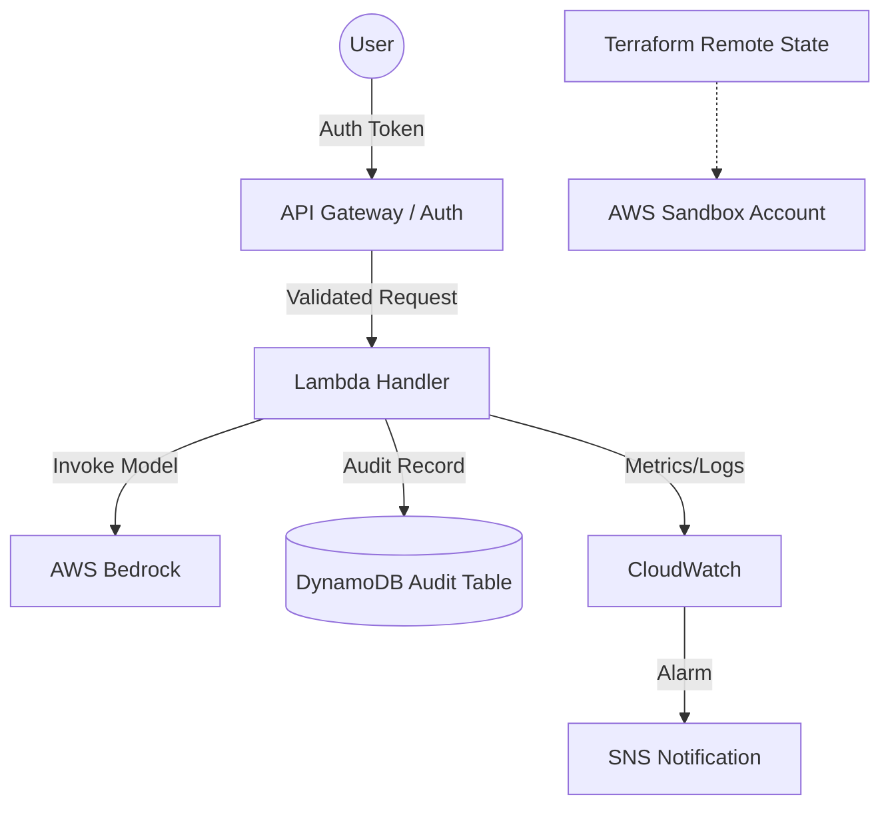

# Day 07 Architecture

This diagram represents the state of the infrastructure platform at the end of Sprint 1 (Day 07).

```mermaid
graph TD
    User((User)) -->|Auth Token| Gateway[API Gateway / Auth]
    Gateway -->|Validated Request| Lambda[Lambda Handler]
    Lambda -->|Invoke Model| Bedrock[AWS Bedrock]
    Lambda -->|Audit Record| DynamoDB[(DynamoDB Audit Table)]
    Lambda -->|Metrics/Logs| CloudWatch[CloudWatch]
    CloudWatch -->|Alarm| SNS[SNS Notification]
    Terraform[Terraform Remote State] -.-> Infrastructure[AWS Sandbox Account]
```
